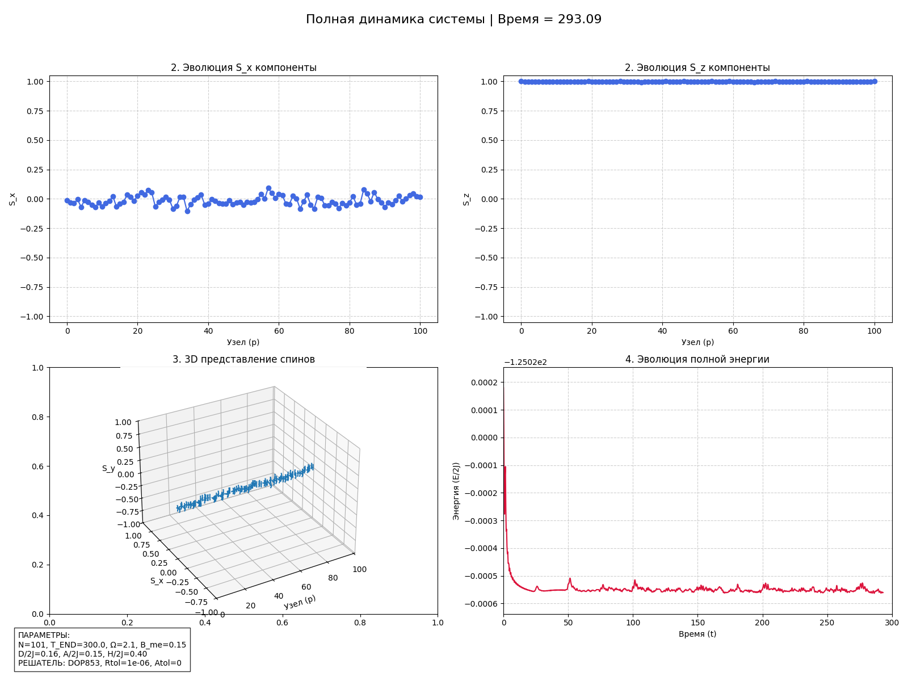

# Magneto-Elastic Spin Breathers Simulation


## Overview

This project implements a numerical simulation of **nonlinear magnetic excitations (breathers)** in 1D ferromagnetic chains coupled with atomic lattice vibrations. It investigates the **magneto-elastic coupling** effect, where atomic vibrational modes (phonons) can excite or sustain magnetic oscillation modes (magnons/breathers).

The software solves a coupled system of:
1.  **Landau-Lifshitz equation** (Magnetic dynamics).
2.  **Fermi-Pasta-Ulam (FPU) model** (Atomic lattice dynamics).

The result is a visualized dynamics of spin components ($S_x, S_y, S_z$) and total energy evolution, rendered into an animated GIF.


*(Example of the simulation output: 3D spin representation and component evolution)*

## Key Features

*   **High-Precision Integration:** Uses `scipy.integrate.solve_ivp` with the **DOP853** (Explicit Runge-Kutta method of order 8) for high accuracy over long simulation times.
*   **Magneto-Elastic Coupling:** Implements a localized modulation of magnetic anisotropy based on atomic strain ($B_{me}$ parameter).
*   **Parallel Rendering:** Utilizes Python's `multiprocessing` to parallelize frame generation, significantly speeding up the visualization pipeline.
*   **Hybrid Initial State:** Automatically constructs a hybrid state with a localized "conical phase" in the center and a ferromagnetic background.

## Installation

1.  Clone the repository:
    ```bash
    git clone https://github.com/YOUR_USERNAME/spinbreathers.git
    cd spinbreathers
    ```

2.  Create a virtual environment (recommended):
    ```bash
    python -m venv venv
    # Windows
    venv\Scripts\activate
    # macOS/Linux
    source venv/bin/activate
    ```

3.  Install dependencies:
    ```bash
    pip install -r requirements.txt
    ```

## Usage

Run the main simulation script:

```bash
python spinbreathers.py
```

The script will:
1.  Initialize the atomic pumping function.
2.  Calculate the initial magnetic state based on strain.
3.  Run the numerical integration (this may take time depending on `T_END`).
4.  Generate frames in parallel.
5.  Save the results (logs and `combined_dynamics.gif`) in a new folder named `breather_run_YYYYMMDD_HHMMSS`.

## Configuration

You can adjust the physical and simulation parameters in the `GLOBAL CONFIGURATION` section of `spinbreathers.py`:

### Grid & Time

| Parameter | Description | Default |
| :--- | :--- | :--- |
| `N_SITES` | Number of sites in the chain (atoms/spins) | `101` |
| `T_MAGNETIC_END` | Total simulation time (dimensionless) | `300.0` |
| `FRAME_COUNT` | Number of frames for the output GIF | `1000` |

### Physics Parameters

| Parameter | Description | Typical Value |
| :--- | :--- | :--- |
| `ATOMIC_OMEGA` | Frequency of the atomic breather ($\Omega$) | `2.1` |
| `J_EXCHANGE` | Exchange interaction constant | `1.0` |
| `D_DMI` | Dzyaloshinskii-Moriya Interaction ($D/2J$) | `0.16` |
| `A_ANISOTROPY` | Easy-plane anisotropy ($A/2J$) | `0.15` |
| `H_EFF` | External magnetic field ($H/2J$) | `0.40` |
| `B_ME_COUPLING` | Magneto-elastic coupling strength | `0.15` |

## Dependencies

*   **NumPy:** Vectorized numerical operations.
*   **SciPy:** ODE solvers (`solve_ivp`) and optimization (`curve_fit`).
*   **Matplotlib:** Scientific plotting (2D and 3D).
*   **ImageIO:** GIF assembly.
*   **Tqdm:** Progress bars.

---
```